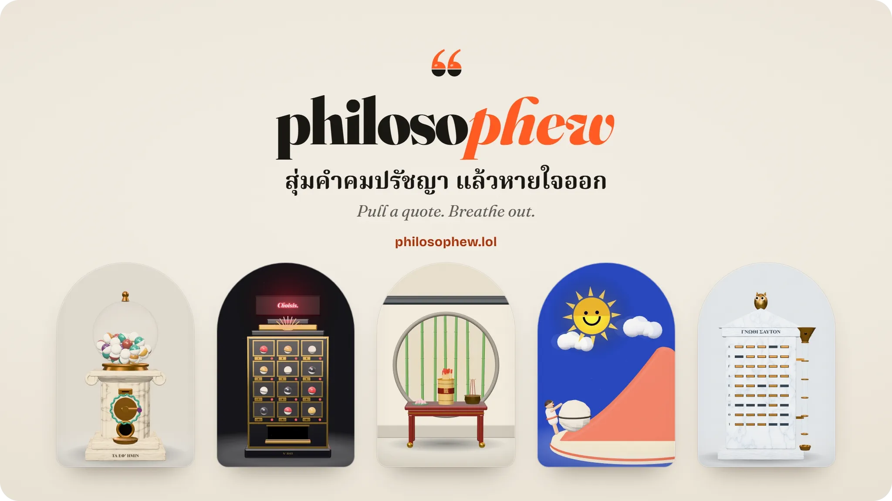
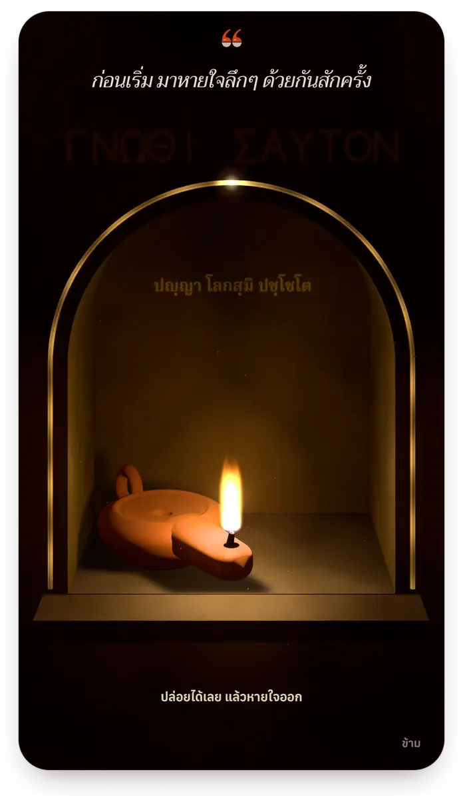
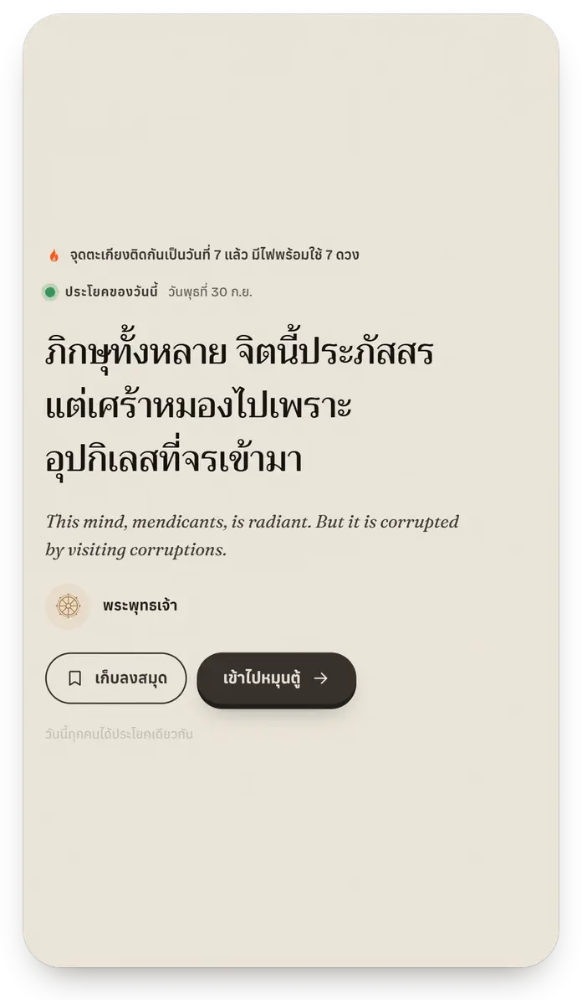
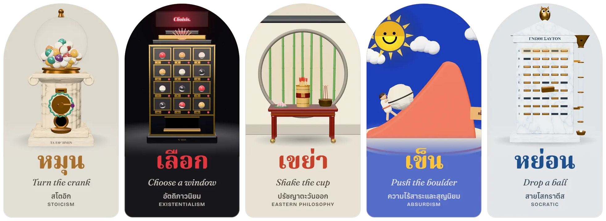
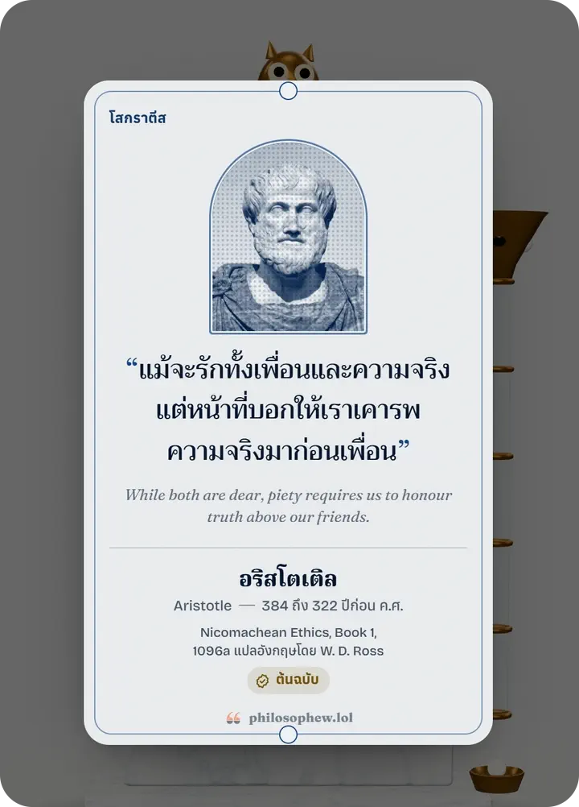
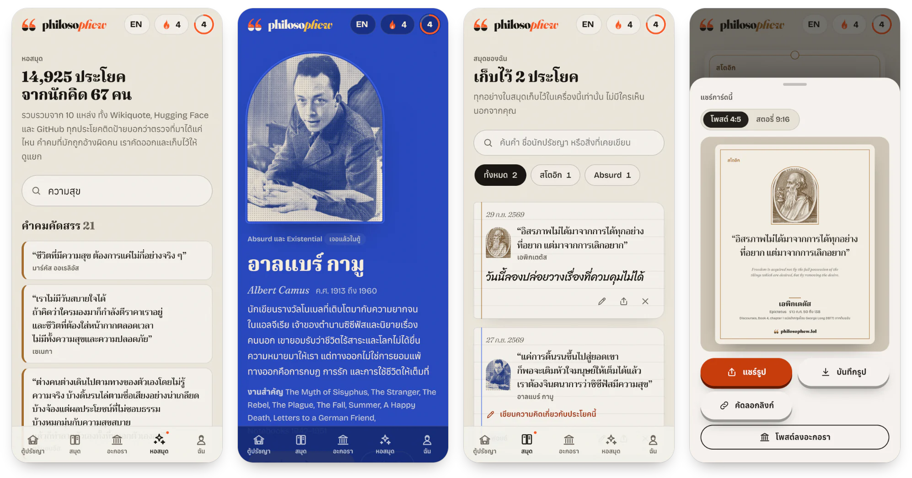
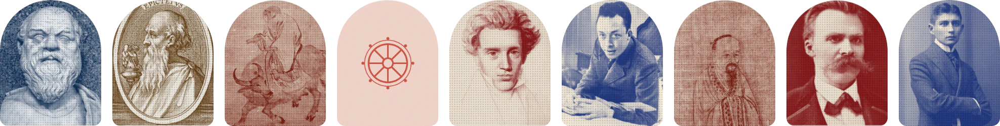

<a href="https://philosophew.lol">
<picture>
  <source media="(prefers-color-scheme: dark)" srcset="docs/readme/hero-dark.webp">
  
</picture>
</a>

<p align="center">
<b>ปรัชญา แต่&NoBreak;ทำให้ใจได้&NoBreak;หายใจ&NoBreak;ออก</b><br>
ตู้กาชาปองที่&NoBreak;สุ่มคำคมจาก&NoBreak;นัก&NoBreak;ปรัชญาตัว&NoBreak;จริง พร้อมแหล่ง&NoBreak;ที่มาที่&NoBreak;ตรวจ&NoBreak;สอบได้ ให้&NoBreak;คุณ&NoBreak;เก็บ คิด และ&NoBreak;แชร์&NoBreak;ต่อ
</p>

<p align="center">
<b>Philosophy that lets you breathe&nbsp;out.</b><br>
A gacha machine of real philosophers’ words, with sources you can check, to keep, think about and&nbsp;share.
</p>

<p align="center">
<a href="https://philosophew.lol"></a>
</p>

<p align="center"><sub>ภาษา&NoBreak;ไทย&NoBreak;เป็น&NoBreak;หลัก สลับเป็นภาษา&NoBreak;อังกฤษได้ใน&NoBreak;ปุ่มเดียว เล่นได้โดย&NoBreak;ไม่&NoBreak;ต้องมี&NoBreak;บัญชี<br>
Thai first, English one tap away. No account needed to&nbsp;play.</sub></p>

<br>

<h3 align="center">หว่าน<br><sub>Sow: Philosophew 1.0 is open source</sub></h3>

https://github.com/user-attachments/assets/70802488-4848-4688-96a5-7d5258b0ce8b

<p align="center"><sub>เปิดโค้ดก็เหมือน&NoBreak;หว่านเมล็ด เราไม่ได้&NoBreak;เก็บไว้กับตัว แต่หว่าน&NoBreak;ออกไปให้&NoBreak;คนอื่น&NoBreak;ปลูกต่อ<br>
Opening the code is sowing seed: scattered for others to&nbsp;grow.<br>
Vincent van Gogh, <i>The Sower</i> (1888, public domain). The bust on the card: Marie-Lan Nguyen, CC BY&nbsp;2.5.</sub></p>

<br>

<h3 align="center">หายใจ<br><sub>Breathe</sub></h3>

<p align="center">
&emsp;
</p>

<p align="center"><sub>วันแรกจบที่&NoBreak;ชื่อของ&NoBreak;เรา &emsp; วันต่อๆ&nbsp;ไปจบที่&NoBreak;ประโยค&NoBreak;ของ&NoBreak;วัน&NoBreak;นี้<br>
The first day ends on our name; every day after, on today’s&nbsp;line.</sub></p>

<p align="center">
ทุก&NoBreak;วันเริ่ม&NoBreak;ด้วยการ&NoBreak;หายใจลึกๆ สัก&NoBreak;ครั้ง เพื่อ&NoBreak;จุดตะเกียงและ&NoBreak;เติมไฟไว้หมุน&NoBreak;ตู้<br>
กดค้างไว้หนึ่งลม&NoBreak;หายใจ ปล่อย&NoBreak;มือแล้วหายใจ&NoBreak;ออก แล้วแสงจะไหลท่วมทั้งหน้า&NoBreak;จอ
</p>

<p align="center">
Each day starts with one deep breath. It lights your lamp and fills your&nbsp;flames.<br>
Hold for one breath, 3.2 seconds. Let go, breathe out, and the light floods the&nbsp;page.
</p>

<p align="center"><sub>สลัก&NoBreak;ไว้&NoBreak;ใน&NoBreak;ซุ้ม <b>ปญฺญา โลก&NoBreak;สฺ&NoBreak;มิ ปชฺโช&NoBreak;โต</b> แปล&NoBreak;ว่า ปัญญาเป็นแสง&NoBreak;สว่าง&NoBreak;ใน&NoBreak;โลก<br>
Carved in the niche: <i>paññā lokasmi pajjoto</i>, wisdom is the light of the&nbsp;world.</sub></p>

<p align="center"><sub>ประโยค&NoBreak;ของ&NoBreak;วัน&NoBreak;นี้ ทุก&NoBreak;คนได้ประโยคเดียวกัน และ&NoBreak;เกือบทุก&NoBreak;วันจะมาใน&NoBreak;สีประจำ&NoBreak;วันแบบ&NoBreak;ไทย<br>
Today’s line is the same for everyone, and on most days it comes in the Thai colour of the&nbsp;day.</sub></p>

<br>

<h3 align="center">เลือก&NoBreak;ตู้&NoBreak;ตามใจ<br><sub>Pick by&nbsp;feeling</sub></h3>

<p align="center">
<picture>
  <source media="(max-width: 600px)" srcset="docs/readme/machines-phone.webp">
  
</picture>
</p>

<p align="center">
ห้า&NoBreak;สำนัก&NoBreak;คิด ห้า&NoBreak;ตู้ ห้า&NoBreak;วิธี&NoBreak;สุ่ม ถ้าไม่รู้จะเลือกตู้ไหน ก็&NoBreak;บอกเราว่า&NoBreak;วัน&NoBreak;นี้ใจเป็น&NoBreak;ยัง&NoBreak;ไง<br>
Five schools, five machines, five ways to draw. Not sure? Tell us how you feel&nbsp;today.
</p>

<p align="center"><sub>
<a href="https://philosophew.lol/s/stoic">ตู้สำริดแห่ง&NoBreak;ระเบียงหิน</a> &ensp;
<a href="https://philosophew.lol/s/existential">ตู้&NoBreak;แห่ง&NoBreak;การ&NoBreak;เลือก</a> &ensp;
<a href="https://philosophew.lol/s/eastern">เซียมซี&NoBreak;แห่ง&NoBreak;สายลม</a> &ensp;
<a href="https://philosophew.lol/s/absurd">เนิน&NoBreak;เขาของ&NoBreak;ซิซีฟัส</a> &ensp;
<a href="https://philosophew.lol/s/socratic">เครื่องจับ&NoBreak;ฉลาก&NoBreak;แห่ง&NoBreak;เอเธนส์</a><br>
The Bronze Stoa, Le Distributeur, Fortune Sticks, Sisyphus’ Hill, The&nbsp;Kleroterion
</sub></p>

<br>

<h3 align="center">รับ&NoBreak;การ์ด<br><sub>Get a&nbsp;card</sub></h3>

<p align="center">

</p>

<p align="center">
การ์ดมีภาพจริงของ&NoBreak;ผู้&NoBreak;พูด คำ&NoBreak;แปล&NoBreak;ไทย และ&NoBreak;ที่มา บาง&NoBreak;ใบ&NoBreak;เป็น&NoBreak;ฟอยล์ และ&NoBreak;นานๆ&nbsp;ทีจะได้ทองคำ&NoBreak;เปลว<br>
Cards show the real person, the words, and where they come from. Some are foil; a few are gold&nbsp;leaf.
</p>

<p align="center"><sub>ใน&NoBreak;คลิป การ์ดกระดาษของ&NoBreak;อริสโตเติล การ์ดฟอยล์ของ&NoBreak;เอ&NoBreak;พิก&NoBreak;เต&NoBreak;ตัส และ&NoBreak;การ์ดทองคำ&NoBreak;เปลว&NoBreak;ของ&NoBreak;ไคร&NoBreak;ซิป&NoBreak;ปัส<br>
In the clip: Aristotle on paper, Epictetus in foil, Chrysippus in gold&nbsp;leaf.</sub></p>

<br>

<h3 align="center">เก็บ เขียน&nbsp;แชร์<br><sub>Keep, write,&nbsp;share</sub></h3>

<p align="center">
<picture>
  <source media="(prefers-color-scheme: dark)" srcset="docs/readme/screens-dark.webp">
  
</picture>
</p>

<p align="center">
เก็บ&NoBreak;ลง&NoBreak;สมุด เขียนความ&NoBreak;คิดเพื่อ&NoBreak;รับไฟคืน แชร์&NoBreak;เป็น&NoBreak;รูป หรือ&NoBreak;โพสต์ลงอะกอราให้คน&NoBreak;อื่น&NoBreak;อ่าน<br>
Keep it, write a reflection to earn a flame back, share it as an image, or post it to the&nbsp;Agora.
</p>

<p align="center"><sub>หอ&NoBreak;สมุด หน้า&NoBreak;ของ&NoBreak;นัก&NoBreak;คิด สมุด&NoBreak;ของ&NoBreak;ฉัน และ&NoBreak;รูปการ์ดสำหรับ&NoBreak;แชร์<br>
The library, a thinker’s page, the notebook and a card drawn to&nbsp;share.</sub></p>

<br>

<h3 align="center">เราตรวจที่มา&NoBreak;ยัง&NoBreak;ไง<br><sub>How we check&nbsp;sources</sub></h3>

<p align="center">

</p>

<p align="center">
นัก&NoBreak;คิด&NoBreak;&nbsp;<b>67</b>&nbsp;&NoBreak;คน จาก&NoBreak;&nbsp;<b>5</b>&nbsp;&NoBreak;สำนัก&NoBreak;คิด<br>
<sub>67 thinkers from five schools of&nbsp;thought</sub>
</p>

<p align="center">
การ์ด&NoBreak;&nbsp;<b>528</b>&nbsp;&NoBreak;ใบ ทุก&NoBreak;ใบ&NoBreak;มี&NoBreak;ที่มา <b>324</b>&nbsp;ใบเจอใน&NoBreak;ตัวบทต้นฉบับ อีก&NoBreak;&nbsp;<b>204</b>&nbsp;ใบมีแหล่งอ้างอิงที่&NoBreak;ตรวจ&NoBreak;สอบ&NoBreak;ได้<br>
<sub>528 cards, every one with its source:&nbsp;324 found in the primary text, 204 tied to the author by a checkable&nbsp;source</sub>
</p>

<p align="center">
หอ&NoBreak;สมุด&NoBreak;&nbsp;<b>14,925</b>&nbsp;&NoBreak;ประโยค รวมการ์ดทั้งหมดกับ&NoBreak;อีก&nbsp;14,397&nbsp;ประโยคจาก 10&NoBreak;&nbsp;&NoBreak;แหล่ง ทุกประโยคติด&NoBreak;ป้ายว่า&NoBreak;ตรวจที่มาได้แค่&NoBreak;ไหน<br>
<sub>A library of 14,925 lines: the cards, and 14,397 more from 10 sources, every line labelled with how sure we&nbsp;are</sub>
</p>

<p align="center">
คำคมดัง&NoBreak;ที่&NoBreak;มักถูกอ้างผิด&NoBreak;คน เรา&NoBreak;ไม่&NoBreak;ใส่&NoBreak;ใน&NoBreak;ตู้ แต่&NoBreak;รวบรวมไว้ใน&NoBreak;หัวข้อ “&NoBreak;ไม่&NoBreak;ได้&NoBreak;พูด แต่&NoBreak;คน&NoBreak;ชอบ&NoBreak;แชร์&NoBreak;” ใน&NoBreak;หน้าของ&NoBreak;นัก&NoBreak;ปรัชญาคน&NoBreak;นั้น<br>
<sub>Famous misattributions never enter the machines; they are collected under “Never said it, often shared” on that philosopher’s&nbsp;page</sub>
</p>

<p align="center">
ภาพจริงของ&NoBreak;นัก&NoBreak;คิด&nbsp;<b>64</b>&nbsp;&NoBreak;ภาพ แต่ละภาพระบุสัญญาอนุญาต มู&NoBreak;โซ&NoBreak;เนีย&NoBreak;ส รู&NoBreak;ฟัส ไม่มีภาพเหมือนหลงเหลือ จึงใช้กระดาษปาปิรุสที่&NoBreak;บันทึกคำ&NoBreak;สอนของ&NoBreak;ท่าน พระพุทธเจ้าและ&NoBreak;หลวง&NoBreak;พ่อ&NoBreak;ชา เราใช้ธรรมจักรแทนภาพบุคคล&NoBreak;ด้วย&NoBreak;ความ&NoBreak;เคารพ<br>
<sub>64 real portraits, each with its licence; no likeness of&nbsp;Musonius Rufus survives, so a papyrus of his words stands in; for the Buddha and Ajahn Chah, a Dharma wheel instead of a figure, out of&nbsp;respect</sub>
</p>

<br>

<h3 align="center">เรื่อง&NoBreak;เล็กที่&NoBreak;เรา&NoBreak;ใส่ใจ<br><sub>The small&nbsp;things</sub></h3>

<p align="center">
เสียงทุกเสียงสังเคราะห์สด&NoBreak;ด้วย Web Audio ไม่มีไฟล์เสียง&NoBreak;เลยสัก&NoBreak;ไฟล์<br>
<sub>Every sound is synthesised live with Web Audio. There is not one audio&nbsp;file.</sub>
</p>

<p align="center">
เราตัดบรรทัดภาษา&NoBreak;ไทย&NoBreak;เอง คำ ชื่อ และ&NoBreak;วลี&NoBreak;สั้นๆ จะไม่ขาดกลางบรรทัด ตรวจแล้วกับ&NoBreak;เอนจินของ Chrome, Safari และ Firefox<br>
<sub>We set the Thai line breaks ourselves: a word, a name or a short phrase never breaks across lines, checked in the engines of&nbsp;Chrome, Safari and&nbsp;Firefox.</sub>
</p>

<p align="center">
หลัง&NoBreak;เปิด&NoBreak;ครั้ง&NoBreak;แรก ใช้ได้แม้ไม่มีเน็ต ยกเว้นอะกอราและ&NoBreak;หอ&NoBreak;สมุดฉบับเต็มของ&NoBreak;นัก&NoBreak;คิด&NoBreak;แต่ละ&NoBreak;คน<br>
<sub>After the first visit it works offline; only the Agora and each thinker’s full library need the&nbsp;network.</sub>
</p>

<p align="center">
สมุด ตะเกียง และ&NoBreak;คอล&NoBreak;เลก&NoBreak;ชันเก็บอยู่ใน&NoBreak;เครื่องของ&NoBreak;คุณ จะเข้า&NoBreak;สู่&NoBreak;ระบบเพื่อ&NoBreak;ใช้ข้ามเครื่องก็ได้ และ&NoBreak;เราไม่ใช้ตัวติดตาม&NoBreak;โฆษณา<br>
<sub>Your notebook, lamp and collection live on your device; sign in only if you want them on your other devices too. No ad&nbsp;trackers.</sub>
</p>

<br>

<h3 align="center">สร้าง&NoBreak;ด้วย<br><sub>Built with</sub></h3>

<p align="center">
Vite + TypeScript (no UI framework), three.js, Web Audio, Neon Functions + Postgres,&nbsp;Vercel
</p>

<br>

<h3 align="center">รัน&NoBreak;เอง<br><sub>Run it&nbsp;yourself</sub></h3>

<p align="center">
ตัว&NoBreak;แอป&NoBreak;เป็น&NoBreak;เว็บ static รันได้ทันทีโดย&NoBreak;ไม่&NoBreak;ต้องมีคีย์หรือ&NoBreak;ฐานข้อมูล ส่วนบัญชีผู้&NoBreak;ใช้และ&NoBreak;อะกอราต้องมี Neon Postgres กับ&NoBreak;ฟังก์ชัน API<br>
<sub>The app is a static site: it runs with no keys and no database. Accounts and the Agora need Neon Postgres and the API&nbsp;function.</sub>
</p>

```bash
npm ci
npm run dev      # the app on http://localhost:5178, with no .env file at all
npm run build    # the static site in dist/, for any static host
```

With accounts and the Agora:

1. Make a Neon project and copy `.env.example` to `.env.local`. The Neon CLI’s `neon env pull` writes `DATABASE_URL`; a comment above every other name says what it is for.
2. `npm run migrate` applies `db/*.sql` to that database (schema `pw`; every file can run again).
3. `node scripts/api-local.mjs` serves the API on http://localhost:8787 and prints sign-in codes instead of mailing them. With `NEON_FUNCTION_API_BASE_URL=http://localhost:8787` in `.env.development.local`, `npm run dev` sends `/api` there.
4. To go live, `npm run deploy:api` deploys `api/index.ts` as a Neon Function (`neon.ts`); its address goes in place of `your-neon-function-host.invalid` in `vercel.json`, the static site’s `/api` rewrite.

A copy that runs in public needs a name, a mark and an address of its own ([NOTICE.md](NOTICE.md)). The address is written in `api/index.ts` (`SITE`, `ORIGINS` and the mail’s sender), `api/email.ts`, `scripts/prerender.mjs` and `scripts/check-seo.mjs`.

<details>
<summary><b>พัฒนา&NoBreak;ต่อ</b> &ensp;<sub>Develop</sub></summary>

<br>

```bash
npm install
npm run dev                            # the app on http://localhost:5178
npm run check                          # types (tsc --noEmit)
npm run data                           # data/roster.json + data/curated/*.json -> public/data
npm run build                          # data, types, vite build, then a static page for every quote and thinker
node scripts/check-seo.mjs --browser   # after a build: every page, its title, its words without JavaScript
```

Look before you ship:

```bash
node scripts/shot.mjs http://localhost:5178/ out.png --mobile   # one screen, phone size
node scripts/qa-sheet.mjs mobile sheet.png --pull                # every machine and what it gives
node scripts/qa-lines.mjs --engine webkit                        # where every Thai word lands, 21 screens by 11 widths
node scripts/qa-ritual.mjs mobile out/ --video                   # films the breath
node scripts/perf-gpu.mjs --mobile                               # frame times on the real GPU
```

The API is one Neon Function (`api/index.ts`) over Neon Postgres: `npm run migrate` and `npm run deploy:api` read their keys from `.env.local`, which never leaves your machine.

The pictures in this README are rendered from the app itself: the launch film’s takes, and the current build filmed on the same virtual clock. Its Thai is set the way the app sets it (`src/core/thai.ts`), and its numbers are the live site’s.

Contributors start with [docs/DATA-BRIEF.md](docs/DATA-BRIEF.md): the roster and the schools, the verify levels, the tags and moods, and how the Thai is written.

</details>

<br>

<h3 align="center">ขอบคุณ<br><sub>Credits</sub></h3>

<p align="center">
ภาพ&NoBreak;นัก&NoBreak;คิด&NoBreak;จาก Wikimedia Commons ใช้ตามสัญญาอนุญาตของ&NoBreak;แต่ละภาพ ราย&NoBreak;ชื่อพร้อมสัญญาอนุญาตอยู่ที่ <a href="https://philosophew.lol/about">philosophew.lol/about</a><br>
<sub>Portraits from Wikimedia Commons, each under its own licence, every one listed on the About&nbsp;page.</sub>
</p>

<p align="center">
ฟอนต์ Fraunces, Bricolage Grotesque, Trirong, Anuphan, Noto Serif Thai และ Sriracha ใช้&NoBreak;สัญญา&NoBreak;อนุญาต SIL Open Font License&nbsp;ทั้งหมด<br>
<sub>Fonts: all under the SIL Open Font&nbsp;License.</sub>
</p>

<p align="center">
แหล่ง&NoBreak;ข้อมูลของ&NoBreak;หอ&NoBreak;สมุดและ&NoBreak;สัญญาอนุญาต อยู่&NoBreak;ใน <a href="public/data/library/index.json"><code>public/data/library/index.json</code></a><br>
<sub>The library’s sources and their licences, with how many lines each&nbsp;gave.</sub>
</p>

<p align="center">
ภาพเก่าใน&NoBreak;หนังเปิดตัว เป็นสาธารณสมบัติหรือ CC0&NoBreak;&nbsp;&NoBreak;ทุก&NoBreak;ภาพ<br>
<sub>The archive images in the launch film are all public domain or&nbsp;CC0.</sub>
</p>

<br>

<h3 align="center">สัญญา&NoBreak;อนุญาต<br><sub>Licences</sub></h3>

<p align="center">
โค้ดใช้สัญญาอนุญาต MIT ตาม&NoBreak;ไฟล์ <a href="LICENSE">LICENSE</a> ส่วน&NoBreak;ภาพ&NoBreak;นัก&NoBreak;คิด ฟอนต์ หอ&NoBreak;สมุด คำคม ชื่อ และ&NoBreak;โลโก้&NoBreak;ของ&NoBreak;เรา มีเงื่อนไขของ&NoBreak;ตัว&NoBreak;เอง อยู่&NoBreak;ใน <a href="NOTICE.md">NOTICE.md</a><br>
<sub>The code is under the MIT licence in <a href="LICENSE">LICENSE</a>. The portraits, the fonts, the library, the quotes, and our name and mark keep terms of their own, set out in <a href="NOTICE.md">NOTICE.md</a>.</sub>
</p>

<p align="center">
หอ&NoBreak;สมุดใน&NoBreak;รีโพนี้เก็บไว้ 8,578&NoBreak;&nbsp;&NoBreak;ประโยค เฉพาะประโยคจาก&NoBreak;แหล่งที่&NoBreak;เปิดสัญญาอนุญาต อีก&nbsp;5,819&nbsp;ประโยคใน&NoBreak;เว็บมา&NoBreak;จาก&NoBreak;ชุดข้อมูลที่&NoBreak;เงื่อนไขยังไม่เปิด สคริปต์&NoBreak;ใน <code>scripts/data/library</code> ดึง&NoBreak;มา&NoBreak;ใหม่&NoBreak;ได้<br>
<sub>This repository’s library keeps the 8,578 lines an openly licensed source carries. The site’s other 5,819 come from datasets whose terms are not that open, and <code>scripts/data/library</code> fetches them&nbsp;again.</sub>
</p>

<br>

<p align="center">
<a href="https://philosophew.lol">
<picture>
  <source media="(prefers-color-scheme: dark)" srcset="docs/readme/sign-dark.webp">
  
</picture>
</a>
</p>

<p align="center"><sub>
โค้ดใช้สัญญาอนุญาต MIT งานแปลและ&NoBreak;งาน&NoBreak;เขียนของ&NoBreak;เราใช้ CC BY 4.0&nbsp;ส่วนชื่อกับ&NoBreak;โลโก้ยังเป็น&NoBreak;ของ&NoBreak;เรา<br>
The code: MIT. Our translations and our own writing: CC BY 4.0. The name and the mark stay&nbsp;ours.<br>
<a href="mailto:philosophew@yahoo.com">philosophew@yahoo.com</a>
</sub></p>
